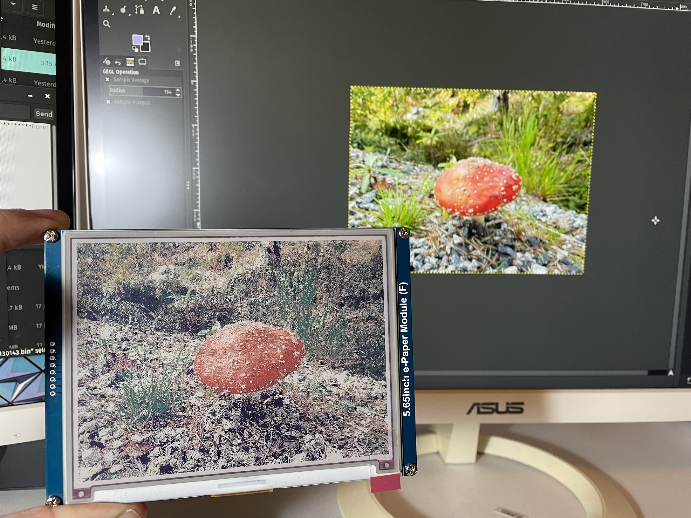

# Pitagram

> A multi-color digital photo frame that **streams 134 KB frames through 2.5 KB of SRAM**, draws **0.3 mA at rest**, and runs for **roughly four months** between charges on a recycled Nokia phone battery.


---

## Why I built this

The spark was a YouTube video about color e-paper. I had never actually
seen one in person and wanted to know two things: *what does ACeP color
really look like in real light?*, and *how far can battery life be pushed
on a panel that, in principle, draws nothing while it's not refreshing?*

I gave myself one self-imposed constraint: **build it almost entirely from
off-the-shelf parts**. No custom PCB, no exotic silicon, no chasing the
last microamp with charge pumps and supercaps. The whole bill of materials
is a Pro Micro, a Waveshare panel, a microSD breakout, two P-MOSFETs, a
recycled Nokia phone battery, and a TP4056 USB charger.

---

## By the numbers

| Metric                         | Value                                       |
| ------------------------------ | ------------------------------------------- |
| MCU SRAM                       | 2.5 KB total                                |
| Streaming buffer in RAM        | 256 B (~10 % of SRAM)                       |
| Frame size on SD               | 134.4 KB (600 × 448 × 4 bpp)                |
| Idle current (measured)        | **0.3 mA**                                  |
| Battery                        | Recycled Nokia BL-5C-class, ~1 000 mAh      |
| Calculated autonomy (idle)     | 1 000 mAh ÷ 0.3 mA ≈ **138 days**           |
| With daily image rotation      | ≈ **4 months** between charges              |
| Sleep wake source              | AVR watchdog, 8-second tick                 |
| Display refresh cycle          | ~25 s for a full 7-color update             |
| Image rotation cadence         | 24 h, counted in 10 800 WDT ticks           |

---

## Engineering decisions

Each of the choices below is the load-bearing one: most of them
unlocked the rest.

- **MOSFET power gating, not just deep sleep.** An ATmega32U4 in
  `SLEEP_MODE_PWR_DOWN` is microamps, but the SD card's controller
  continues drawing 50–200 µA while VCC is applied (chip-select doesn't
  cut current to its internal logic), and the EPD's charge-pump circuit
  leaks similarly. Two P-MOSFETs on the high side cut the peripherals
  out of the VCC rail entirely, which is how the 0.3 mA total budget
  becomes reachable.

- **Offline image pipeline, not on-MCU quantization.** Floyd-Steinberg
  error diffusion against a 7-color palette on a 600 × 448 image needs
  at minimum two scanlines of working memory. With 2.5 KB of SRAM, two
  RGB scanlines alone are 3.5 KB: it doesn't fit. Doing the dithering
  offline moves the entire CPU and SRAM cost out of the runtime budget
  permanently.

- **Single SPI bus shared between SD and EPD.** Saves four GPIOs on a
  pin-starved 32U4 (the USB hardware eats half the port). Bus
  arbitration is trivial because the power-gating sequence guarantees
  that only one peripheral is ever powered at a time; there's no
  electrical possibility of contention.

- **Streaming chunks instead of a frame buffer.** A frame is 134 400
  bytes. SRAM is 2 560. The constraint dictates the architecture: the
  EPD driver pulls 256 B at a time from a callback that reads straight
  off the open SD `File`. The image never exists in RAM in one piece.

- **Floyd-Steinberg over ordered dithering.** Error diffusion produces
  noticeably better quality than Bayer-style ordered dithering at the
  cost of being inherently serial and slower. Since the entire pipeline
  runs on a PC once per image, "slower" is free. Quality wins.

- **Watchdog as the only periodic wake.** An external RTC (DS3231,
  PCF8523, etc.) would give precise daily timing, but adds a part, an
  I²C bus, and a couple of µA of leakage through pull-ups. The AVR's
  internal watchdog timer is ±10 % accurate, which on a 24-hour rotation
  means images change at any moment within a couple of hours of the
  nominal time. Acceptable for a photo frame. Fatal for an alarm clock.

---

## Hardware

| Part            | Notes                                                                 |
| --------------- | --------------------------------------------------------------------- |
| MCU             | SparkFun Pro Micro **3.3 V / 8 MHz** (ATmega32U4)                     |
| Display         | Waveshare 5.65" 7-color ACeP, model **5.65inch e-Paper (F)**, 600 × 448 |
| Storage         | microSD card on shared hardware SPI bus                               |
| SD power gate   | P-MOSFET on SD VCC, driven by MCU **D6** (high-side switch)           |
| EPD power gate  | P-MOSFET on EPD VCC, driven by MCU **D7** (high-side switch)          |
| Button          | Momentary push-button to GND on **D2 / INT1**, internal pull-up       |
| Battery         | Nokia BL-5C-class Li-ion cell (~1 000 mAh, 3.7 V nominal)             |
| Charger         | Any TP4056-style USB Li-ion charging board                            |

Datasheets are not redistributed in this repository (Waveshare copyright).
The official wiki is the source of truth:
<https://www.waveshare.com/wiki/5.65inch_e-Paper_Module_(F)>

---

## Image pipeline

The MCU never touches a JPEG. Quantization and dithering happen on a PC
ahead of time, so the firmware only memcpys bytes from SD to the EPD.
A Makefile runs convert.py on each new image that needs to be converted.

```
source_pictures/*.{jpg|jpeg|png}
        │
        ▼
     Makefile
        │
        ▼
   tools/convert.py        # EXIF rotate → autocontrast → boxblur → gamma →
        │                  # Lanczos resize → center-crop → Floyd-Steinberg
        │                  # quantize against the 7-color panel palette
        ▼
converted_pictures/*.bin   # 16-byte PTG header + raw 4bpp linear pixels
                           # SdFat build (no LFN) can find them
                           # → Copy these to the SD card
```

### Binary format (`ImgFormatDefs.h` / `convert.py`)

| Offset | Size  | Field    | Value                                            |
| -----: | ----: | -------- | ------------------------------------------------ |
|      0 |     3 | magic    | ASCII `"PTG"`                                    |
|      3 |    13 | reserved | zero-filled                                      |
|     16 | W·H/2 | pixels   | 4 bpp, two pixels per byte, MSB first, row-major |

### 7-color palette

| Index | Color  | RGB                |
| ----: | ------ | ------------------ |
|     0 | Black  | (0, 0, 0)          |
|     1 | White  | (255, 255, 255)    |
|     2 | Green  | (67, 138, 28)      |
|     3 | Blue   | (100, 64, 255)     |
|     4 | Red    | (191, 0, 0)        |
|     5 | Yellow | (255, 243, 56)     |
|     6 | Orange | (232, 126, 0)      |

A real photo dithered against this palette, side-by-side with the source:



The panel renders one color per pixel from the palette above. Floyd-Steinberg
error diffusion spreads quantization error to neighbouring pixels, and the
eye reconstructs intermediate tones from spatial mixing; the detail in the
soil and out-of-focus background is dithering doing its job. Without it, the
same scene would collapse into solid color blobs.

---

## Firmware architecture

PlatformIO project at `firmware/platformio/pitagram/`. Target:
`sparkfun_promicro8` (ATmega32U4, 8 MHz). Single library dependency:
[`greiman/SdFat`](https://github.com/greiman/SdFat), configured for
FAT16/FAT32 only and minimal cache to fit in 2.5 KB of SRAM.

### Modules

| Module             | Responsibility                                                  |
| ------------------ |-----------------------------------------------------------------|
| `main.cpp`         | `setup()` / `loop()`: delegates to `g_power` and `g_pitagram`   |
| `Pitagram`         | Application FSM, image stream, file traversal                   |
| `PowerMgr`         | Sleep, watchdog, MOSFET gating, VCC sense via bandgap reference |
| `MFButtonHandler`  | ISR-driven debounce + multi-click + long-press state machine    |
| `ISR.cpp`          | AVR vector wiring: `WDT_vect`, `INT0_vect`, `INT1_vect`         |
| `epd5in65f`/`epdif`| Waveshare ACeP driver + SPI HAL (extended with stream API)      |

> **On the lack of a proper HAL.** `PowerMgr` is the only module that
> directly touches AVR-specific registers (watchdog, sleep modes, ADC for
> bandgap VCC sense) and would be the natural candidate to sit behind a
> hardware abstraction layer if this were ever ported to another MCU
> family. I deliberately did not build that abstraction: the scope of the
> project was a single prototype, built once, given as a gift. Paying the
> design cost of a HAL for a target that will never be ported is exactly
> the kind of premature abstraction worth resisting. If a v2 ever lands
> on an STM32L0 (see roadmap), `PowerMgr` is what gets split into an
> interface and an `avr/` implementation; everything else is already
> portable.

### Modifications to the Waveshare driver

The stock Waveshare reference driver assumes the host has enough RAM to
hold a full frame and busy-waits on the BUSY line in a tight loop.
Neither assumption survives in 2.5 KB of SRAM on a battery-powered MCU,
so I extended `epd5in65f` with two injection points:

- **`dataProviderCallback`** — invoked by the EPD driver every time it
  needs the next chunk of pixels. The application registers a callback
  that reads `kCfgBufferSize` (256 B) straight from the open SD `File`
  and hands the bytes back. The driver pushes them out over SPI without
  ever materialising a full frame in RAM. This is what makes the
  streaming architecture actually work end-to-end.

- **`waitProviderCallback`** — invoked while the driver would otherwise
  spin on the BUSY line waiting for the panel to finish a command. The
  application's callback parks the MCU in `SLEEP_MODE_PWR_DOWN` and
  relies on `INT0` (wired to BUSY) to wake it the moment the panel
  releases the line. Steady-state current during a refresh becomes
  the EPD's own draw, not the AVR's.

Both additions preserve the original Waveshare MIT-style headers in
`epd5in65f.{cpp,h}` and `epdif.{cpp,h}` as required.

### State machine

```
              ┌────────────────────┐
              │  STATE_CHANGE_IMG  │  Power up SD → pick next file →
              └─────────┬──────────┘  power up EPD → stream → power both off
                        │
              success   │   error
                        ▼
              ┌────────────────────┐      ┌────────────────────┐
              │ STATE_WAIT_FOR_NEXT│◀────▶│   STATE_WAIT_RETRY │
              └─────────┬──────────┘      └──────────┬─────────┘
                        │                            │
       long press / low │ batt              retry    │
                        ▼                            │
              ┌────────────────────┐                 │
              │  STATE_STANDBY     │                 │
              │  / STATE_LOW_BATT  │                 │
              └────────────────────┘                 │
                        ▲                            │
                        └────────────────────────────┘
```

Every state ends with the MCU in `SLEEP_MODE_PWR_DOWN`. The only periodic
wake source is the watchdog timer; `INT1` (the button) wakes asynchronously
on user input. Even while the EPD is busy, the firmware sleeps between
BUSY polls instead of busy-waiting, so steady-state current is essentially
the EPD's own.

### Power-gating sequence

```
powerUpSD():    set D6 HIGH → P-MOSFET on  → settle delay → SdFat.begin()
powerDownSD():  SdFat.end() → set D6 INPUT → MOSFET off (gate floats up)
```

Identical pattern on D7 for the EPD. SPI pins are returned to `INPUT`
between transactions so leakage through the (now unpowered) peripheral
cannot back-feed VCC through the protection diodes.

---

## Usage

Single button on D2: four actions on the same physical input:

| Gesture          | Action                                              |
| ---------------- |-----------------------------------------------------|
| 1 click          | Next image                                          |
| 2 clicks         | Previous image                                      |
| 3 clicks         | Reset the 24 h rotation timer (keep current longer) |
| Long press       | Standby: clear screen to white and deep sleep       |
| Click in standby | Wake, redisplay current image                       |

A persistent marker file on the SD card remembers which image was last
displayed, so the rotation survives power cycles and battery swaps.

---

## Repository layout

```
pitagram/
├── assets/                # README images and icon sources
├── firmware/              # PlatformIO project (Arduino C++)
│   └── platformio/pitagram/
├── tools/                 # Offline Python pipeline (Pillow + numpy)
├── Makefile               # Drives the offline pipeline
├── LICENSE                # MIT
└── README.md              # This file
```

Photo directories (`source_pictures/`, `converted_pictures/`) are gitignored: bring your own.

---

## Build & flash

See **[BUILDING.md](./BUILDING.md)** for PlatformIO and Python setup,
flashing the Pro Micro, and running the image pipeline.

---

## Roadmap

- Fix `tools/convert.py` resolution: it crops to 600 × 480 but the panel
  is 600 × 448. The extra 32 rows get truncated by the firmware, but the
  pre-crop aspect ratio is wrong, shifting framing.
- Schedule a periodic full-screen "clean" pass to mitigate ghosting,
  per the Waveshare specification.
- On-screen battery-level indicator. Today the firmware only uses the
  bandgap-measured VCC to gate into `STATE_LOW_BATTERY`.
- Burn `BODLEVEL = 111` to fully disable the brown-out detector and
  reclaim its standby current.

### What I'd do differently on v2

- Add an external RTC (DS3231) for accurate daily rotation independent of
  WDT drift.
- Move to an ATmega328PB or an STM32L0 to escape the 32U4's USB
  pin-eating without losing the deep-sleep budget.
- Custom PCB combining the MOSFET gating, the TP4056 charger, and the
  Pro Micro footprint: current build is three breakouts on perfboard.
- Swap the voltage regulator in the board for a lower power LDO
---

## License

**MIT** (see [LICENSE](./LICENSE)).

Bundled third-party drivers retain their original Waveshare MIT-style
headers (`firmware/.../src/epd5in65f.*` and `epdif.*`). The single
runtime dependency, [greiman/SdFat](https://github.com/greiman/SdFat),
is also MIT.

## Acknowledgements

- A YouTube video on color e-paper that started this whole rabbit hole.
- **Waveshare** for the 5.65" 7-color ACeP panel and the Arduino
  reference driver this project's EPD layer is derived from.
- **Bill Greiman** for SdFat: without it, 2.5 KB of SRAM would not be
  enough to talk to a FAT32 card.
